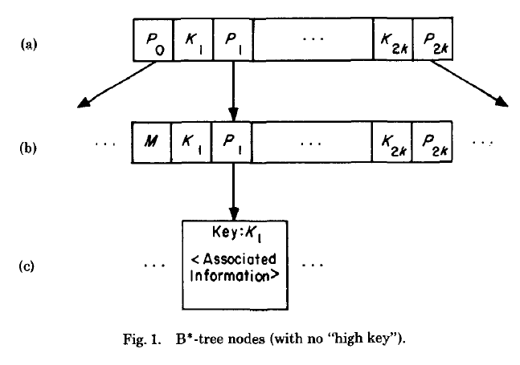
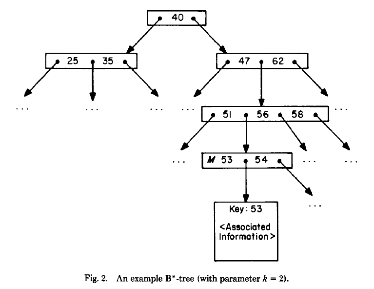

# Efficient Locking for Concurrent Operations on B-Trees

# 目录
* [1.介绍](#1、介绍)
* [2.存储模型](#2、存储模型)
* [3.数据结构](#3、数据结构)
  * 3.1 B*树
    * 3.3.1 结构
    * 3.1.2 排序 
  * 3.2 以前的方法
  * 3.3 并发B树
* [4.搜索算法](#4、搜索算法)
* [5.插入算法](#5、插入算法)
* [6.正确性证明](#6、正确性证明)
* [7.删除](#7、删除)
* [8.锁效率](#8、锁效率)
* [9.结论](#9、结论)
* [10.参考](#10、参考)

---------------------------------------------------------
　　B树和它的变种在存储大量信息的情况下是非常有用的（在理论和实践中），尤其是在二级存储设备中。我们使用了一个实用的存储模型，来克服在这种结构上进行并发操作的困难。在每个结点中单一的附加指针可以很容易地让一个进程恢复树的被其他进程修改过的改变，我们的方法和之前利用锁模式的方法相比更加简单（没有使用读锁），只是在任何时刻，任何更新进程锁定一个很小的结点的常量数字。这里也给出了一个非正式的正确性证明。
## 1、介绍
　　B树和它的变种作为一种存储大文件的数据结构，在近些年已经被广泛使用了，尤其是在二级存储设备中。这种结构可以保证较少的(平均)搜索，插入，和删除时间，这点在数据库程序中非常有吸引力。  
　　当今数据库设计的一个热点为数据库可以被几个进程并发和正确地操作。在本论文中，我们提出了一个B树的变种（实际上是Wedekind提出B\*树），它特别适用于并发数据库系统。  
    B\*树的并发操作已经被Bayer、Schkolnick和其他人讨论过。本论文中给出的方法有这样一个优点，操作树的任何进程在任何时刻使用一个锁（常量）数字。而且，不会阻止对树的任何节点的搜索（锁只是用来防止对结点的更新操作）。这些操作不会应用于先前的方案。  
　　相似的问题（并发二叉树）已经在Kung和Lehman的论文中讨论过了，本论文他们论文中的一些观点，并且把它们应用到了存储在二级存储设备上的并发树结构。此外，B树的问题解决也很有实用性。  
　　当前的分析是把B数作为主索引，扩展为二级索引就简单了。

## 2、存储模型
　　我们假设数据库存储在二级存储设备上，这里主要是指磁盘。许多进程可以同时操作这些数据。每个进程只可以通过把数据从磁盘读入进程空间（内存）来检查或修改数据。为了修改再磁盘上的数据，进程必须把数据从内存再写到磁盘上。  
　　磁盘被划分成固定大小的扇区（本篇论文中指的是物理页面，和逻辑树结点一致）。这是进程可以读或写的单元。而且，一个进程有固定数量的主存大小，所以只可以同时检查固定数量的页面数。一个进程的主存不和其他内存共享。  
　　最后，一个进程可以加锁和解锁一个磁盘页面。这种锁机制可以让进程有独有的对页面的修改权限，一个进程也必须获得一个页锁来修改页。锁不会阻止其他进程读一个上锁的页。  
　　对于锁请求，我们提出了一些锁规则，例如，FIFO和优先进程优先锁等。在如下给出的算法协议和证明中，我们使用如下的符号。小写符号（x,t,current等）是指一个进程的主存的变量（包括指针），大写符号（A,B,C）是指主存的块。主存的块被用来读和写磁盘的页面。   
　　`lock(x)`是指针x指向的磁盘页面。如果这个页面已经被其他进程上锁，则操作等待直到获取到锁。  
　　`unlock(x)`释放一个锁。  
　　`put(A,x)`把内存块A的内容写入到x指向的页面中。这个过程必须让一个进程获得要操纵页面的锁。  
　　总之，为了修改一个页面x，进程必须指向一下操作：  
  > lock(x);  
  > A <- get(x); //把x从磁盘读入内存  
  > modify data in A;  
  > put(A,x);   //从内存写入到磁盘  
  > unlock(x);  

## 3、数据结构
### 3.1 B*树
　　在这部分我们开发了一种并发进程使用的数据结构。这种数据结构是Wedekind描述的B\*树（基于Bayer和McCreight定义的B树）的简单变种。B\*树的定义如下。
#### 3.3.1、结构 
　　(a) 从根结点到任何叶结点的任何路径有相同的长度h；  
　　(b) 除了根结点和叶结点的任何结点至少有k+1个子结点。（k是一个树参数，2k是一个结点拥有的最大数目的元素，忽略高键）；  
　　(c) 根结点或者是一个叶结点或者至少有两个子结点；  
　　(d) 每一个结点至多有2k+1个子结点；    
　　(e) B\*树中所有数据的键存储在叶结点当中，叶结点也含有指向数据库记录的指针。（每一个键对应一个记录。）非叶结点包含指针和在接下来使用指针的键值。   
　　B\*树包含下图所示的结点。

$$K_{i}$$是K域，$$P_{i}$$是指针，$$P_{i}$$指向其他的结点，或者，如果$$P_{i}$$在叶结点中，则可能指向与在叶结点存储的键值相关的记录。在我们的模型中叶结点和非叶结点有相同结构。M是一个叶结点的标志，它在一个非叶结点中占用和第一个指针相同的位置。下图是一个B\*树。

#### 3.1.2 排序
  (a) 在每个结点中，键是正序排列的；
  (b) 在B*树中，一个额外的值被称作“高健”，有时被添加到非叶结点中；
### 3.2 以前的方法
### 3.3 并发B树
## 4、搜索算法

## 5、插入算法

## 6、正确性证明
## 7、删除

## 8、锁效率

## 9、结论

## 10、参考
[Efficient Locking for Concurrent Operations on B-Trees](https://pages.cs.wisc.edu/~zuyu/summaries/cs764/bLinkTree)